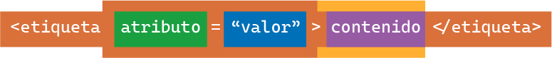
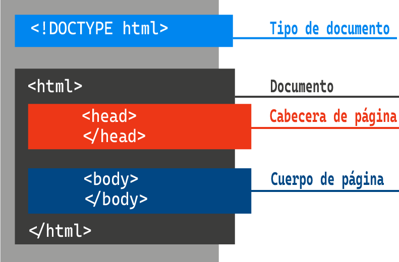

# **HTML BÁSICO** 🌐

Este documento contiene una guía básica para aprender las etiquetas más importantes de HTML. Aquí encontrarás ejemplos y explicaciones para estructurar contenido web.

---

## _🎯 ESTRUCTURA DE UNA ETIQUETA_



---

## _🎯 ESTRUCTURA DE UNA PÁGINA WEB_



---

## _📄 PÁRRAFOS Y ENCABEZADOS_

| Etiqueta | Descripción                                               |
| -------- | --------------------------------------------------------- |
| `p`      | Define un párrafo, usado para contenido escrito.          |
| `h1`     | Encabezado principal, usado para el título del sitio web. |
| `h2`     | Subtítulo principal.                                      |
| `h3`     | Subtítulo de nivel 3.                                     |
| `h4`     | Subtítulo de nivel 4.                                     |
| `h5`     | Subtítulo de nivel 5.                                     |
| `h6`     | Subtítulo de nivel 6.                                     |

### Ejemplo:

```html
<h1>Este es un título principal</h1>
<h2>Este es un subtítulo</h2>
<p>Este es un párrafo explicativo.</p>
```

## _📝 LISTAS_

| Etiqueta | Descripción                             |
| -------- | --------------------------------------- |
| `ol`     | Crea una lista ordenada.                |
| `ul`     | Crea una lista desordenada.             |
| `li`     | Define un elemento dentro de una lista. |

### Ejemplo:

```html
<ul>
  <li>Elemento 1</li>
  <li>Elemento 2</li>
</ul>
<ol>
  <li>Primer elemento</li>
  <li>Segundo elemento</li>
</ol>
```

## _🔗 ENLACES (básico)_

| Etiqueta | Descripción                                                |
| -------- | ---------------------------------------------------------- |
| `a`      | Crea un enlace a otros sitios o páginas.                   |
| `href`   | Especifica la ruta del sitio web a enlazar.                |
| `target` | Indica dónde abrir el enlace(`_blank` para nueva pestaña). |

### Ejemplo:

```html
<a href="https://www.google.com" target="_blank">Ir a Google</a>
```

## _🔷 IMAGENES_

| Etiqueta | Descripción                                                 |
| -------- | ----------------------------------------------------------- |
| `img`    | Muestra imágene en la página.                               |
| `src`    | Especifica la ruta de la imagen.                            |
| `alt`    | Texto alternativo que se muestra si la imagen no carga.     |
| `title`  | Descripción que aparece al pasar el cursor sobre la imagen. |

### Ejemplo:

```html

```

## _⚓ RUTAS_

| Tipo de Ruta | Descripción                                       |
| ------------ | ------------------------------------------------- |
| `Absolutas`  | No cambian sin importar la ubicación del archivo. |
| `Relativas`  | Dependen de la ubicación del archivo actual.      |

## _🔒 FORMULARIOS_

| Etiqueta      | Descripción                                                 |
| ------------- | ----------------------------------------------------------- |
| `form`        | Crea un formulario.                                         |
| `input`       | Permite ingresar datos.                                     |
| `type`        | Define el tipo de entrada (texto, contraseña, email, etc.). |
| `name`        | Identificador del campo de entrada.                         |
| `placeholder` | Texto guía dentro del campo de entrada.                     |
| `required`    | Hace que el campo sea obligatorio.                          |
| `value`       | Valor predeterminado del campo.                             |

### Ejemplo:

```html
<form>
  <input type="text" name="nombre" placeholder="Escribe tu nombre" required />
  <input type="submit" value="Enviar" />
</form>
```

---
